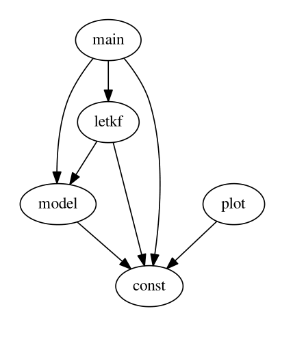

# unified_da

## How to use
```bash
make
evince image/merged.pdf
```

## Dependency of modules


* main: run nature run, observation, and DA cycle. Output is saved at **data/**
* da_system: wrapper for DA algorithms
* letkf: LETKF core programs
* model: model integration and TLM
* obs: observation generation and xb -> yb transform
* plot: all visualization functions. Read **data/** and write **image/**
* const: Run-time settings

## Todo
* Better modularbility by OOP
